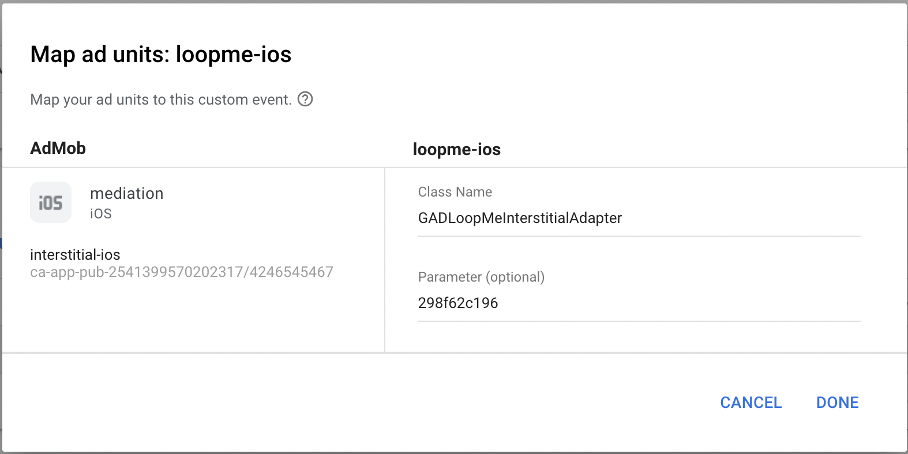

# LoopMe AdMob Bridge #

The `LoopMe` bridge allows you to mediate between `AdMob` interstitial ads and `LoopMe`.
<br/><b>NOTE</b>: This page assumes you have accounts on `AdMob` and `LoopMe` dashboards and already integrated with the `AdMob` SDK.

The bridge is compatible with `LoopMe` SDK v5.1.2 and higher, tested with `AdMob` SDK v7.10.1.

### Create and configure custom event on AdMob dashboard ###

<b>NOTE:</b> `LoopMe` is not available as a predefine network in the AdMob tool, SDK bridge needs to be manually configured with AdMob "Custom Event" option.

* Click <b>Edit/Create Mediation Group</b>
<p></p>

* Click <b>Add Custom Event.</b>
<p></p>
Enter the event name and real eCPM that you have got after LoopMe publisher team approval. Click Continue.<br>
Note: you find eCPM on the LoopMe Dashboard > Apps & Sites > Ad Spot information.

* Enter the <b>Class Name</b> and <b>Parameter</b>. You will get:
<p></p>

__Class Name__ should be: 'GADLoopMeInterstitialAdapter'. <br>
__Parameter__: enter the app key value you received after registering your Ad Spot on the LoopMe dashboard. <br>E.g. '298f62c196'.<br>
* Click __Done__
* Copy __GADLoopMeInterstitialAdapter.h__ and __GADLoopMeInterstitialAdapter.m__ to Your project
* Allocate traffic by entering an eCPM value for the custom event. Your allocation options are the same as they are for ad networks
* Click __Save__

### Adding LoopMe SDK to your project ###

* Download `LoopMeSDK` from this repository
* Copy `LoopMeUnitedSDK.embeddedframework` to your project (alternatively you can use LoopMeSDK sorce code)
* Copy `LoopMeMediation` folder to your project
* Make sure the following frameworks are added in `Xcode` project's `build phases`
  * `MessageUI.framework`
  * `StoreKit.framework`
  * `AVFoundation.framework`
  * `CoreMedia.framework`
  * `AudioToolbox.framework`
  * `AdSupport.framework`
  * `CoreTelephony.framework`
  * `SystemConfiguration.framework` 
  
### Usage ###
Before start using `LoopMeSDK` you have to initialiaze it. 

* Import <LoopMeUnitedSDK/LoopMeSDK.h> in your **first** `ViewController`.

```objectivec
#import <LoopMeUnitedSDK/LoopMeSDK.h>
```

* Call `initSDKFromRootViewController:completionBlock :` to initialize SDK. 

```objectivec

[[LoopMeSDK shared] initSDKFromRootViewController:self completionBlock:^(BOOL success, NSError *error) {
    if (!success) {
        NSLog(@"%@", error);
    }
}];

```

* You can configure `LoopMeSDK` by passing `LoopMeSDKConfiguration` object into `initSDKFromRootViewController:sdkConfiguration:completionBlock:`.


* Do not load video without wi-fi. Set NO by default
 
```objectivec
LoopMeSDKConfiguration *configuration = [LoopMeSDKConfiguration new];
configuration.doNotLoadVideoWithoutWiFi = YES;
```

* Get SDK initialization state

If you want to know LoopMe sdk's current intialization state check `LoopMeSDK.shared.isReady` property.

AdMob SDK will automatically find LoopMe Bridge and will use it to ad showing.

### Sample project ###

Check out our `AdMobAdapterDemo` project as an integration sample.
