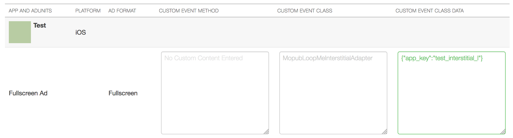
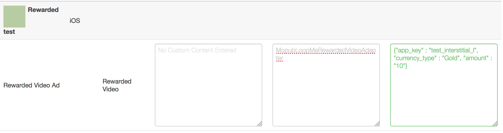
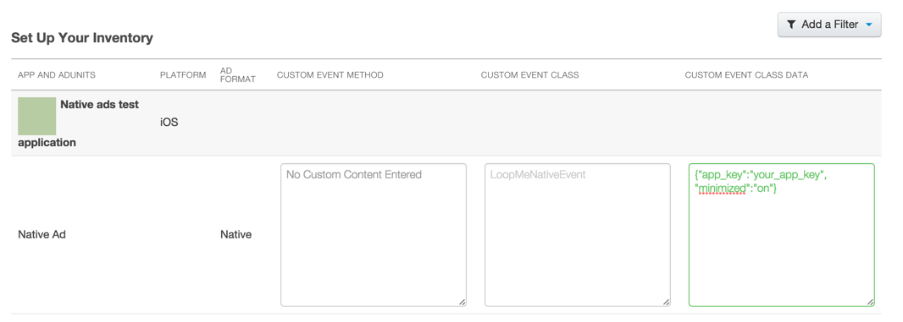

# LoopMe Mopub Interstitial Ad Bridge

The `LoopMe` bridge allows you to mediate between `Mopub` interstitial ads and `LoopMe` interstitial ads.

The bridge is compatible with `LoopMe` SDK v5.1.2 and higher and tested with `Mopub` SDK v4.9.1.

### Create and configure custom native network on Mopub dashboard ###

In order to mediate between Mopub interstitial ads and LoopMe interstitial ads you have to configure networks waterfall.
<b>NOTE:</b> `LoopMe` is not available as a predefine network in the Mopub tool, SDK bridge needs to be manually configured with Mopub "Custom Native Network" option.

* On Mopub dashboard click Networks -> add a network. Choose `Custom Native Network`
* Configure `Custom Network` in the following way:

<b>custom event class</b>: MopubLoopMeInterstitialAdapter <br/>
<b>custom event class data</b>: {"app_key" : "YOUR_APP_KEY"}  <br/>
<b>NOTE:</b> You will get a unique app_key from the `LoopMe` dashboard when registering your ad spot.

### Adding LoopMe SDK to your project ###

* Download `LoopMeSDK` from this repository
* Copy `LoopMeSDK` folder to your project (alternatively you can use LoopMeSDK as a subproject or build static library)
* Copy `MopubLoopMeInterstitialAdapter.h` and `MopubLoopMeInterstitialAdapter.m` folder to your project 

### Sample project ###

Check out our `LoopMeMediatonDemo` project as an integration sample.

# LoopMe Mopub Rewarded Video Ad Bridge

The `LoopMe` bridge allows you to mediate between `Mopub` Rewarded Video ads and `LoopMe` Rewarded Video ads.

The bridge is compatible with `LoopMe` SDK v5.1.2 and higher and tested with `Mopub` SDK v4.9.1.

### Create and configure custom native network on Mopub dashboard ###

In order to mediate between Mopub Rewarded Video ads and LoopMe Rewarded Video ads you have to configure networks waterfall.
<b>NOTE:</b> `LoopMe` is not available as a predefine network in the Mopub tool, SDK bridge needs to be manually configured with Mopub "Custom Native Network" option.

* On Mopub dashboard click Networks -> add a network. Choose `Custom Native Network`
* Configure `Custom Network` in the following way:

<b>custom event class</b>: MopubLoopMeRewardedVideoAdapter <br/>
<b>custom event class data</b>: {"app_key" : "YOUR_APP_KEY", "currency_type" : "YOUR_CURRENCY_TYPE", "amount" : "YOUR_AMOUNT"}  <br/>
<b>NOTE:</b> You will get a unique app_key from the `LoopMe` dashboard when registering your ad spot.

### Adding LoopMe SDK to your project ###

* Download `LoopMeSDK` from this repository
* Copy `LoopMeSDK` folder to your project (alternatively you can use LoopMeSDK as a subproject or build static library)
* Copy `MopubLoopMeRewardedVideoAdapter.h` and `MopubLoopMeRewardedVideoAdapter.m` folder to your project 

### Sample project ###

Check out our `LoopMeMediatonDemo` project as an integration sample.

# LoopMe Mopub Native Ad Bridge #

The `LoopMe` bridge allows you to mediate between `Mopub` native ads and `LoopMe` video banner.
<br/><b>NOTE</b>: This page assumes you have accounts on `Mopub` and `LoopMe` dashboards and already integrated with the `Mopub`SDK for native ads.
<br/><b>NOTE</b>: These instructions assume you are using `MPNativeAdRequest` but NOT `MPTableViewAdManager` to trigger `Mopub` native ads loading. 

The bridge is compatible with `LoopMe` SDK v5.1.2 and tested with `Mopub` SDK v3.10.0.

### Create and configure custom native network on Mopub dashboard ###

In order to mediate between Mopub native ads and LoopMe video banner you have to configure networks waterfall.
<b>NOTE:</b> `LoopMe` is not available as a predefine network in the Mopub tool, SDK bridge needs to be manually configured with Mopub "Custom Native Network" option.

* On Mopub dashboard click Networks -> add a network. Choose `Custom Native Network`
* Configure `Custom Network` in the following way:

<b>custom event class</b>: LoopMeNativeEvent <br/>
<b>custom event class data</b>: {"app_key":"your_app_key"} <br/>
<b>NOTE:</b> You will get a unique app_key from the `LoopMe` dashboard when registering your ad spot.
<br/>
Optionally you can insert "minimized" json parameter to let `LoopMe` video ad display minimized ad window during scroll event when ad's cell leaves viewport.<br/>
<b>NOTE:</b> Enabling "minimized" ad make sence if you guarantee that only one `LoopMe` video ad would be displayed in scrollable content. 

### Adding LoopMe SDK to your project ###

* Download `LoopMeSDK` from this repository
* Copy `LoopMeSDK` folder to your project (alternatively you can use LoopMeSDK as a subproject or build static library)
* Copy `LoopMeMediation` folder to your project
* Make sure the following frameworks are added in `Xcode` project's `build phases`
  * `MessageUI.framework`
  * `StoreKit.framework`
  * `AVFoundation.framework`
  * `CoreMedia.framework`
  * `AudioToolbox.framework`
  * `AdSupport.framework`
  * `CoreTelephony.framework`
  * `SystemConfiguration.framework` 
  
### Mediate between Mopub native ads and LoopMe video banner Ad ###

Mediation is done by inserting `LoopMe` video ad object to a `UITableView` `datasource` items and adding as a `subView` to a `UITableViewCell` as a result of executing `MPNativeAdRequest`.

<b>NOTE</b>: Displaying `LoopMe` native video ads requires extra integration steps in order to manage ad activity, e.g. to enable video playback.

* Triggering ads loading
```objc
MPStaticNativeAdRendererSettings *settings = [[MPStaticNativeAdRendererSettings alloc] init];
settings.renderingViewClass = [MopubMopubLoopMeNativeAd class];
MPNativeAdRendererConfiguration *config = [MPStaticNativeAdRenderer rendererConfigurationWithRendererSettings:settings];
config.supportedCustomEvents = @[@"LoopMeNativeEvent"];
MPNativeAdRequest *adRequest = [MPNativeAdRequest requestWithAdUnitIdentifier:APP_ID rendererConfigurations:@[config]];
[adRequest startWithCompletionHandler:^(MPNativeAdRequest *request, MPNativeAd *response, NSError *error) {
    if (!error) {
        response.delegate = self;
        // Insert ad object to dataSouce at some index and reload or add `UITableViewRow`
        [self.contentItems insertObject:response atIndex:indexPath.row];
        [self.tableView insertRowsAtIndexPaths:[NSArray arrayWithObject:indexPath]
                                  withRowAnimation:UITableViewRowAnimationAutomatic];
    }
}];
```
* Adding `LoopMeAdView` as a subView to `UITableViewCell`.

Once you inserted ad object to `UITableView` dataSource and reloaded `UITableView` you should configure ad cell:
```objc
- (UITableViewCell *)tableView:(UITableView *)tableView cellForRowAtIndexPath:(NSIndexPath *)indexPath

  if([self isAdAtIndexPath:indexPath]) // helper method based on defining class of object at indexPath
      {
          UITableViewCell *adCell;
          if ([self isLoopMeAdAtIndexPath:indexPath]) // Defining if object is kind of `MopubLoopMeNativeAd` class
              /*
               * return specific cell for video ad
               * IMPORTANT: make sure you are using different cell identifier since LoopMeAdView is added as a subView to cell
               */
              static NSString *adCellIdentifier;
              MopubLoopMeNativeAd *adObject = (MopubLoopMeNativeAd *)[self.contentItems objectAtIndex:indexPath.row];
              UITableViewCell *adCell = [self.tableView dequeueReusableCellWithIdentifier:adCellIdentifier];
              if (!adCell) {
                adCell = [[UITableViewCell alloc] initWithStyle:UITableViewCellStyleDefault reuseIdentifier:adCellIdentifier];
      }
      
      // Set up LoopMeAdView
      adObject.adView.frame = CGRectMake(0, 0, kLDAdViewWidth, kLDAdViewHeight);
      // Re-assiging delegate since we would like to display video ads here
      // note that you don't have to implement -didLoad, -didFailToLoad methods
      // since it's already loaded
      adObject.adView.delegate = self;
      adObject.adView.scrollView = self.tableView;
      
      // Adding LoopMeAdView as a subView to cell
      [adCell.contentView addSubview:adObject.adView];
      return adCell;

...
```

<b>NOTE</b>: You can return different ad cell height for `LoopMe` video ad in `-heightForRowAtIndexPatsh` method.

* Extra integration steps
In order to let `LoopMeAdView` video ad work properly you should trigger following methos in `UIViewController` lyfecycle and `UIScrollViewDelegate` methods:
```objc
- (void)scrollViewDidScroll:(UIScrollView *)scrollView {
    /*
     * Updating ad visibility in scrollable content in order to manage video ad playback
     */
    [self updateAdViewVisibility];
}

- (void)viewWillAppear:(BOOL)animated {
    [super viewWillAppear:animated];
    
    /*
     * Set video ad visibility to YES in order to calculate visibility area in scrollView and resume playback
     */
    [self setAdVisible:YES];
}

- (void)viewWillDisappear:(BOOL)animated {
    [super viewDidAppear:animated];
    
    /*
     * Set ad visibility to NO in order to pause video ad playback
     */
    [self setAdVisible:NO];
}

//////////////////////////////////////////////////////////////////////

- (void)updateAdViewVisibility {
    for (id item in self.contentItems) {
        if ([item isKindOfClass:[MopubLoopMeNativeAd class]]) {
            [[(MopubLoopMeNativeAd *)item adView] updateAdVisibilityInScrollView];
        }
    }
}

- (void)setAdVisible:(BOOL)visible {
    for (id item in self.contentItems) {
        if ([item isKindOfClass:[MopubLoopMeNativeAd class]]) {
            [[(MopubLoopMeNativeAd *)item adView] setAdVisible:visible];
        }
    }
}
```

* Implement `LoopMeAdViewDelegate` methods.

Implement at least one required method in order to present SDK browser or `StoreKit` product page after click on video ad:
```objc
- (UIViewController *)viewControllerForPresentation {
    return self;
}
```


### Sample project ###

Check out our `LoopMeMediatonDemo` project as an integration sample.
